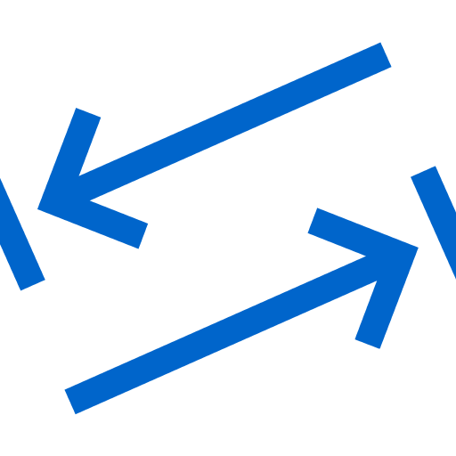

<p align="center">
  
</p>

<h1 align="center">Easy Web Navigation</h1>

<p align="center"><strong>Check how a website works with a keyboard.</strong></p>

<p align="center">
Easy Web Navigation helps you find possible keyboard-access problems, see keyboard focus, and
understand the path through visible controls.
</p>

<p align="center">
  <a href="https://github.com/atj393/easy-web-navigation/actions/workflows/ci.yml"></a>
  <a href="LICENSE"></a>
</p>

---

## Where to get it

| Store                      | Status      |
| -------------------------- | ----------- |
| **Chrome Web Store**       | Coming soon |
| **Microsoft Edge Add-ons** | Coming soon |

Easy Web Navigation is not published yet. Direct install links will be added here once each store
has approved the listing. Until then it can be loaded as an unpacked development build (see
[For developers](#for-developers)).

## How it works

1. **Open a website.**
2. **Select “Check this page”.**
3. **Review** possible problems, keyboard focus, and the keyboard path.

Everything runs locally in your browser. The extension never changes the website.

## What it helps you check

- **Keyboard use** — controls that can be used with a keyboard.
- **Keyboard focus** — a clear highlight showing where focus is right now.
- **Keyboard path** — numbered markers showing the order the Tab key moves through visible controls.
- **Navigation** — page structure that helps people move around (landmarks, skip links).
- **Names and labels** — whether buttons, links, and form fields have understandable names.
- **Clear results** — a readable summary you can **copy** or **download** to share with developers or
  testers.

## Useful for

- Website owners
- Front-end developers
- QA teams
- Accessibility testers
- Keyboard-only users
- Organisations reviewing their websites

## Privacy first

- **Runs locally** in your browser.
- **No account** required.
- **No analytics or tracking.**
- **No page content is uploaded.**
- **No AI and no remote processing.**
- **Reports stay on your device** unless you choose to share them.

## What it does not do

- It does **not** change a website.
- It does **not** fix a website automatically.
- It does **not** replace manual accessibility testing.
- It does **not** certify legal compliance.

A clean result means only that these checks found nothing — it is not a guarantee that a website is
accessible.

## Browser support

- **Google Chrome** (Manifest V3)
- **Microsoft Edge** (Manifest V3, same package as Chrome)
- **Mozilla Firefox** — a development build exists today; published Firefox support is planned.

## Help and feedback

Found a problem or have an idea? Please open an issue:

- **Issues:** https://github.com/atj393/easy-web-navigation/issues
- **How to report well:** see [SUPPORT.md](SUPPORT.md).

> When sharing a report or screenshot, please **remove any private information** first — do not include
> passwords, customer data, personal data, tokens, or confidential page content.

For security concerns, please follow the [Security Policy](SECURITY.md) and report privately rather
than opening a public issue.

## License

Easy Web Navigation is released under the **MIT License**.

Commercial use, modification, and distribution are allowed under the MIT License, provided that the
license and copyright notice are retained. The software is provided without warranty. See
[LICENSE](LICENSE).

---

## For developers

A pnpm + TypeScript monorepo with a WXT + React **Manifest V3** extension and focused analysis
packages. The extension is strictly **read-only**: it never mutates inspected page nodes, changes tab
order, or injects ARIA — the only DOM it creates is its own isolated, extension-owned overlay
container.

### Quick start

```bash
pnpm install
pnpm dev            # Chrome/Edge dev build (WXT)
pnpm dev:firefox    # Firefox dev build
```

Then load the unpacked build from `apps/extension/.output/` in your browser's extension page
(Developer mode → Load unpacked).

### Common scripts

| Script                 | Description                                      |
| ---------------------- | ------------------------------------------------ |
| `pnpm dev`             | Run the extension in development (Chromium).     |
| `pnpm build`           | Production build (Chromium / MV3).               |
| `pnpm build:firefox`   | Production build (Firefox).                      |
| `pnpm typecheck`       | Type-check every workspace package.              |
| `pnpm lint`            | Lint the repository with ESLint.                 |
| `pnpm test`            | Run the Vitest unit tests.                       |
| `pnpm run ci`          | typecheck → lint → test → build.                 |
| `pnpm release:all`     | Build + package store ZIPs into `artifacts/`.    |
| `pnpm release:inspect` | Validate existing store ZIPs (manifest at root). |

> Use `pnpm run ci` (not `pnpm ci` — `ci` is a reserved pnpm command).

### Repository layout

```
apps/
  extension/        WXT + React + MV3 extension (popup, options, background, content)
  demo-sites/       Static HTML pages for manual keyboard testing
packages/
  shared-types/     Framework-agnostic type contracts and message types
  wcag-rules/       WCAG criteria + rule metadata and deterministic rule evaluators
  dom-scanner/      Read-only DOM inspection that produces a ScanResult
  keyboard-engine/  Read-only tab-order computation + keyboard-path visibility filter
  focus-overlay/    Read-only visual overlay (focus helper, issue locator, path markers)
  report-generator/ Markdown + JSON report output
assets/brand/       Canonical brand icon source (downscaled to runtime/store icons)
```

### Permissions

Easy Web Navigation requests the **minimum** permissions and **no broad host permissions**:

| Permission  | Why                                                                |
| ----------- | ------------------------------------------------------------------ |
| `activeTab` | Inspect the current tab only when you invoke the extension.        |
| `scripting` | Inject the read-only content script into the active tab on demand. |
| `storage`   | Persist your preferences locally.                                  |

Optional host permissions (`http://*/*`, `https://*/*`) are requested **only** when you choose
“This website” or “All websites” automatic checking — never at install time and never for manual
checking. The content script is registered at runtime and injected only into the active tab (or, while
automatic checking with a granted scope, into matching tabs you navigate to).

### Brand icon

The official icon lives at
[`assets/brand/easy-web-navigation-icon-source.png`](assets/brand/easy-web-navigation-icon-source.png).
Runtime icons (`apps/extension/public/icon-*.png`) and store/GitHub assets are **downscaled from that
source** by pure-Node scripts (`apps/extension/scripts/generate-icons.mjs`,
`scripts/generate-store-assets.mjs`) — no external dependencies. See
[`assets/brand/README.md`](assets/brand/README.md).

### Releases & store submission

`pnpm release:all` builds the Chromium MV3 package and writes versioned, store-ready ZIPs
(`manifest.json` at the root) to `artifacts/` (git-ignored):

- `artifacts/chrome/easy-web-navigation-chrome-v<version>.zip` — Chrome Web Store
- `artifacts/edge/easy-web-navigation-edge-v<version>.zip` — Microsoft Edge Add-ons (same MV3 build)

Submission is **manual**. Copy-paste-ready listings, privacy policy, permission justifications,
reviewer instructions, a release checklist, and a required manual-QA checklist live in
[`docs/store/`](docs/store/).

### Documentation

- [Architecture](docs/architecture.md) — messaging flow, overlay model, permissions/security.
- [Limitations](docs/limitations.md) — what the tool can and cannot detect (honest scope).
- [Contributing](CONTRIBUTING.md) — setup, scope, workflow, PR checklist.
- [Security](SECURITY.md) — how to report a vulnerability and the privacy posture.
- [Code of Conduct](CODE_OF_CONDUCT.md).

### Accessibility & compliance disclaimer

Easy Web Navigation helps inspect keyboard accessibility at runtime. **It does not certify legal
compliance** with WCAG, BITV, EN 301 549, the European Accessibility Act (EAA), the ADA, or
Section 508. **A clean report is not a compliance pass.** Full accessibility requires source-level
remediation, manual testing, and user testing with assistive technologies. See
[docs/limitations.md](docs/limitations.md).
