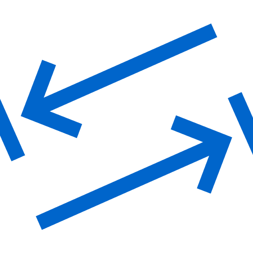
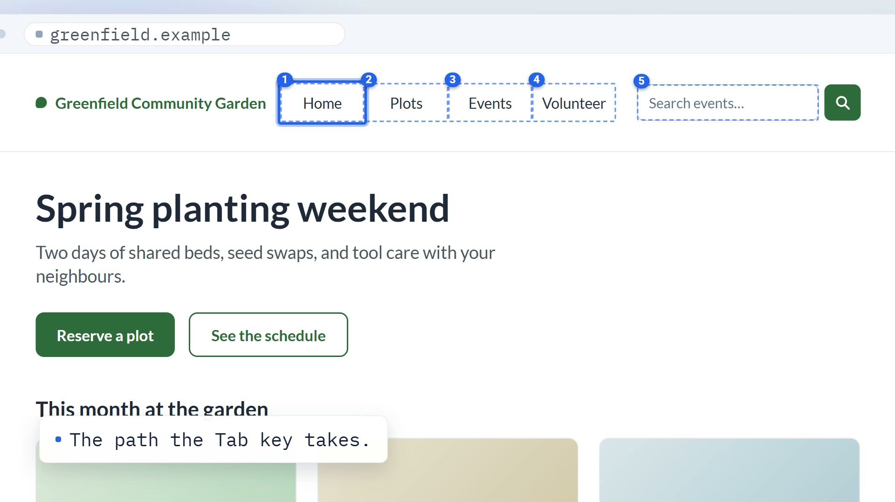
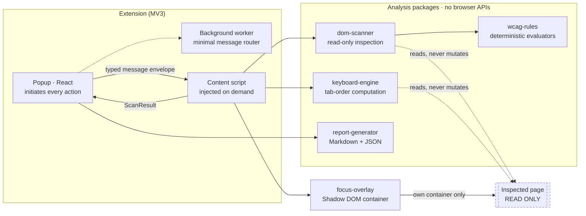

<div align="center">



# Easy Web Navigation

**Keyboard Access Check**

Check how a website works with a keyboard.

A privacy-first browser extension for checking keyboard navigation, focus, and visible keyboard paths.

[](https://github.com/atj393/easy-web-navigation/actions/workflows/ci.yml)
[](https://chromewebstore.google.com/detail/easy-web-navigation-keybo/jaffeipdpljhnfonacndcpjdkclgjiln)
[](LICENSE)
[](https://developer.chrome.com/docs/extensions/mv3/)
[](#testing)
[](#privacy)

[](docs/assets/brag.mp4)

▶ Watch the launch video

</div>

---

**Store name:** Easy Web Navigation - Keyboard Access Check

Easy Web Navigation helps you find possible keyboard-access problems, see where keyboard focus goes,
and understand the path through a page's visible controls, then copy or download the results to share
with developers or testers. It runs locally and never changes the website.

- [Project status](#project-status)
- [Quick start](#quick-start)
- [How it works](#how-it-works)
- [What it helps you check](#what-it-helps-you-check)
- [What it is not](#what-it-is-not)
- [Privacy](#privacy)
- [Permissions](#permissions)
- [Browser support](#browser-support)
- [Known limitations](#known-limitations)
- [Help and feedback](#help-and-feedback)
- [Architecture](#architecture)
- [Interesting engineering problems](#interesting-engineering-problems)
- [Testing](#testing)
- [For developers](#for-developers)
- [License](#license)

---

## Project status

- **Source:** open source under **MIT**, version `1.0.1`.
- **Chrome Web Store:** [live](https://chromewebstore.google.com/detail/easy-web-navigation-keybo/jaffeipdpljhnfonacndcpjdkclgjiln). Edge and Firefox are built and validated on every release but not submitted.
- **Stack:** a pnpm monorepo of six framework-free analysis packages plus a WXT and React Manifest V3 extension.
- **CI:** every push and pull request runs typecheck, lint, 142 unit tests, and both the Chromium and Firefox builds.

## Quick start

<div align="center">

[](https://chromewebstore.google.com/detail/easy-web-navigation-keybo/jaffeipdpljhnfonacndcpjdkclgjiln)

</div>

| Store                  | Status                                                                                                                      |
| ---------------------- | --------------------------------------------------------------------------------------------------------------------------- |
| Chrome Web Store       | **Live**: [install](https://chromewebstore.google.com/detail/easy-web-navigation-keybo/jaffeipdpljhnfonacndcpjdkclgjiln) |
| Microsoft Edge Add-ons | Not submitted. The same Chromium MV3 package is built and validated by `pnpm release:all`.                                   |
| Firefox                | Not submitted. `pnpm build:firefox` produces a working build, but it is not published.                                       |

Edge users can install the Chrome listing directly, or load the Edge ZIP unpacked.

You can also run a production build **unpacked**:

1. Build the extension (see [For developers](#for-developers)) or use a build you already have in
   `apps/extension/.output/chrome-mv3/`.
2. Open `chrome://extensions` (or `edge://extensions`) and turn on **Developer mode**.
3. Click **Load unpacked** and select the build folder.
4. Pin **Easy Web Navigation** and open any website to start.

> Everyday use does not require Node.js. That is only needed for the build step above.

## How it works

1. **Open a website.**
2. **Select "Check this page".**
3. **Review** possible problems, keyboard focus, and the keyboard path.

Everything runs locally in your browser. Easy Web Navigation does not change the website.

## What it helps you check

- **Keyboard use:** controls that can be operated with a keyboard.
- **Keyboard focus:** a clear highlight showing where focus is right now.
- **Keyboard path:** numbered markers showing the order the Tab key moves through visible controls.
- **Navigation:** page structure that helps people move around, such as landmarks and skip links.
- **Names and labels:** whether buttons, links, and form fields have understandable names.
- **Results you can copy or download:** a readable summary to share with developers or testers.

## What it is not

- It does not change a website.
- It does not fix a website automatically.
- It does not replace manual accessibility testing.
- It does not certify legal compliance.

A clean result means only that these checks found nothing. It does not guarantee that a website is
accessible.

## Privacy

Easy Web Navigation is private by design. It runs locally and uploads nothing.

| Information            | What happens                                     |
| ---------------------- | ------------------------------------------------ |
| Website content        | Processed locally in your browser, not uploaded. |
| Your preferences       | Stored locally in browser extension storage.     |
| Results                | Copied or downloaded only when you choose.       |
| Analytics and tracking | None.                                            |
| Remote processing      | None.                                            |
| AI                     | None.                                            |

There is no account, no sign-in, and no remote server. See [SECURITY.md](SECURITY.md) for the security
policy.

## Permissions

| Permission  | Why it is needed                                  |
| ----------- | ------------------------------------------------- |
| `activeTab` | Check the page you choose.                        |
| `scripting` | Run the read-only checker on the page you choose. |
| `storage`   | Remember your preferences locally.                |

- No broad host permissions are required for normal page checking.
- Optional browser access (`http://*/*`, `https://*/*`) is requested **only** when you choose
  automatic checking for "This website" or "All websites", never at install time and never for a
  single page check.
- No permission is used for analytics, advertising, tracking, or remote processing.

## Browser support

- **Google Chrome** (Manifest V3), published on the Chrome Web Store.
- **Microsoft Edge** (Manifest V3, byte-identical package to Chrome), builds and packages cleanly but
  is not submitted to Edge Add-ons.
- **Mozilla Firefox**, builds via `pnpm build:firefox`, not submitted to addons.mozilla.org.

Only the Chrome listing is published today. The other two are packaging targets that are built and
validated on every release, not store listings.

## Known limitations

- Browser-internal pages such as `chrome://` or `edge://` cannot be checked.
- A clean result is not a compliance certificate.
- "This page only" automatic checking may require opening the extension again after you move to
  another page.
- The keyboard path is a visual snapshot and may need refreshing after the page changes.
- The keyboard path caps at 100 markers and reports the total, for example "100 of 342".
- It does not replace manual testing with real users and assistive technologies.

See [docs/limitations.md](docs/limitations.md) for the full, honest list.

## Help and feedback

Found a problem or have an idea? Please open an issue:

- **Issues:** https://github.com/atj393/easy-web-navigation/issues
- **How to report well:** see [SUPPORT.md](SUPPORT.md).
- **Security concerns:** follow the [Security Policy](SECURITY.md) and report privately.

> When sharing a report or screenshot, please **remove anything private first**. Do not post
> passwords, private documents, customer data, tokens, or confidential website content.

## Architecture

A pnpm monorepo: the extension is a thin shell around framework-free analysis packages, so the
logic that matters is testable in Node without a browser.


```mermaid
flowchart LR
    subgraph EXT["Extension (MV3)"]
        POPUP["Popup · React<br/>initiates every action"]
        BG["Background worker<br/>minimal message router"]
        CS["Content script<br/>injected on demand"]
    end

    subgraph PKG["Analysis packages · no browser APIs"]
        SCAN["dom-scanner<br/>read-only inspection"]
        KB["keyboard-engine<br/>tab-order computation"]
        RULES["wcag-rules<br/>deterministic evaluators"]
        REP["report-generator<br/>Markdown + JSON"]
    end

    OVL["focus-overlay<br/>Shadow DOM container"]
    PAGE[["Inspected page<br/>READ ONLY"]]

    POPUP -->|"typed message envelope"| CS
    POPUP -.-> BG
    CS --> SCAN --> RULES
    CS --> KB
    CS --> OVL
    SCAN -.->|"reads, never mutates"| PAGE
    KB -.->|"reads, never mutates"| PAGE
    OVL -->|"own container only"| PAGE
    CS -->|"ScanResult"| POPUP --> REP

    classDef ro stroke-dasharray: 4 4
    class PAGE ro
```

The dashed boundary is the product's central constraint: everything crossing into the page is a
read, except the overlay, which only ever touches a container the extension created itself.

**Required permissions are `activeTab`, `scripting`, and `storage`, with no host permissions at all.**
WXT would normally add `host_permissions: ["<all_urls>"]` for a runtime-registered content script. A
`build:manifestGenerated` hook deletes it. Broad host access is requested at runtime, only if the
user turns on automatic checking for a site.

Full detail: [docs/architecture.md](docs/architecture.md).

## Interesting engineering problems

**1. Drawing on a page without becoming part of it.**
An overlay that highlights focus has to sit above arbitrary third-party CSS without inheriting it,
and without the inspected page's own styles leaking in and breaking the markers. It also must not
become a focusable element, or the tool would alter the very tab order it exists to measure. The
overlay lives in a Shadow DOM container (`attachShadow({ mode: "open" })`) owned by the extension and
removed entirely when unused, so page CSS cannot reach it, its CSS cannot reach the page, and it
contributes nothing to the document's focus order.

**2. Three execution contexts that cannot share memory.**
Popup, background worker, and content script are separate JavaScript realms, and MV3 additionally lets
the browser terminate the background worker at any time. Anything they exchange must survive
structured cloning and an unreliable peer. Message shapes live in `@easy-web-navigation/shared-types`
as a typed envelope, so a change to `ScanResult` is a compile error in every context at once
instead of a runtime `undefined` in one of them. The popup drives the work and messages the tab
directly. The background worker is deliberately kept to a minimal router so there is no state to
lose when it is torn down.

**3. Single-page apps move the ground under the scan.**
A `ScanResult` is a snapshot. In a React or Angular app the DOM it described can be gone a moment
later without a page load, so cached findings quietly become lies. Monitoring watches URL signals to
detect route changes and refresh. That is deliberately best-effort, and documented as such in
[limitations.md](docs/limitations.md) rather than presented as complete.

**4. Three browsers, one implementation.**
Chrome, Edge, and Firefox differ in extension APIs and packaging, and the usual outcome is a
per-browser fork that drifts. Here all real logic sits in browser-free packages that take a DOM and
return data, so the browser-specific surface is only the WXT entrypoints. Chrome and Edge ship a
byte-identical MV3 package. Firefox is a separate build target from the same source. The analysis
packages are tested in Node, so most of the suite never needs a browser at all.

## Testing

**142 unit tests across 9 files**, all passing, run on every push by
[CI](https://github.com/atj393/easy-web-navigation/actions/workflows/ci.yml).

| Package / area | What the tests pin down |
|---|---|
| `dom-scanner` (44) | Read-only inspection, and each rule's positive and negative cases |
| `monitoring` (33) | Automatic-checking state machine, scope handling, teardown |
| `keyboard-engine` (16) | Tab-order computation, visibility filtering, the 100-item cap and its "100 of 342" reporting |
| `focus-overlay` (16) | Shadow-DOM container lifecycle, marker rendering, cleanup |
| `spa-monitoring` (14) | URL-signal route-change detection |
| `report-generator` (6) | Markdown and JSON output shape |
| `clipboard` (5) | Copy and download paths |
| `wcag-rules` (4) | Criteria metadata invariants |
| `shared-types` (4) | Message-envelope invariants |

Because the analysis packages take a DOM and return plain data, they are tested directly in Node,
with no browser automation and no fixtures of a live page.

Not covered: real end-to-end runs in a packaged browser (the demo pages in `apps/demo-sites/` exist
for that, checked by hand), and store-review behaviour.

```bash
pnpm test          # vitest, what CI runs
pnpm run ci        # typecheck, lint, test, build
```

## For developers

A pnpm and TypeScript monorepo with a WXT and React **Manifest V3** extension and focused analysis
packages. The extension is strictly **read-only**: it never mutates inspected page nodes, changes tab
order, or injects ARIA. The only DOM it creates is its own isolated, extension-owned overlay
container.

### Setup

```bash
pnpm install
pnpm dev            # Chrome/Edge dev build (WXT)
pnpm dev:firefox    # Firefox dev build
```

Then load the unpacked build from `apps/extension/.output/` in your browser's extension page
(Developer mode, then Load unpacked).

### Common scripts

| Script                 | Description                                      |
| ---------------------- | ------------------------------------------------ |
| `pnpm dev`             | Run the extension in development (Chromium).     |
| `pnpm build`           | Production build (Chromium / MV3).               |
| `pnpm build:firefox`   | Production build (Firefox).                      |
| `pnpm typecheck`       | Type-check every workspace package.              |
| `pnpm lint`            | Lint the repository with ESLint.                 |
| `pnpm test`            | Run the Vitest unit tests.                       |
| `pnpm run ci`          | typecheck, lint, test, build.                    |
| `pnpm release:all`     | Build and package store ZIPs into `artifacts/`.  |
| `pnpm release:inspect` | Validate existing store ZIPs (manifest at root). |

> Use `pnpm run ci`, not `pnpm ci`, because `ci` is a reserved pnpm command.

### Documentation

- [Architecture](docs/architecture.md): messaging flow, overlay model, permissions and security.
- [Limitations](docs/limitations.md): what the tool can and cannot detect.
- [Contributing](CONTRIBUTING.md): setup, scope, workflow, PR checklist.
- [Security](SECURITY.md): how to report a vulnerability, and the privacy posture.
- [Store documentation](docs/store/): listings, privacy policy, permission justifications, checklists.
- [Brand assets](assets/brand/README.md): the canonical icon source and how variants are generated.

## License

Easy Web Navigation is released under the **MIT License**.

Commercial use, modification, and distribution are allowed under the MIT License, provided that the
license and copyright notice are retained. The software is provided without warranty. See
[LICENSE](LICENSE).
